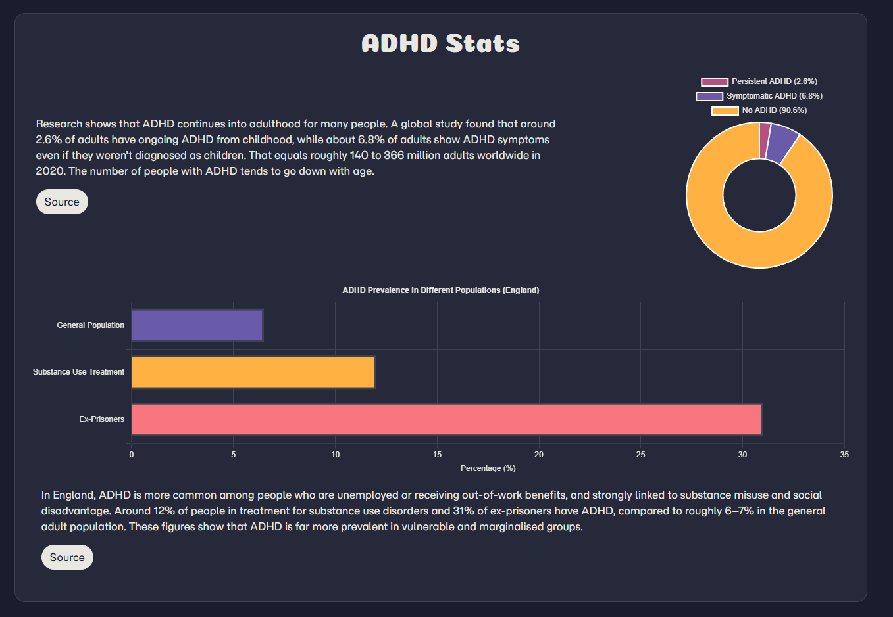
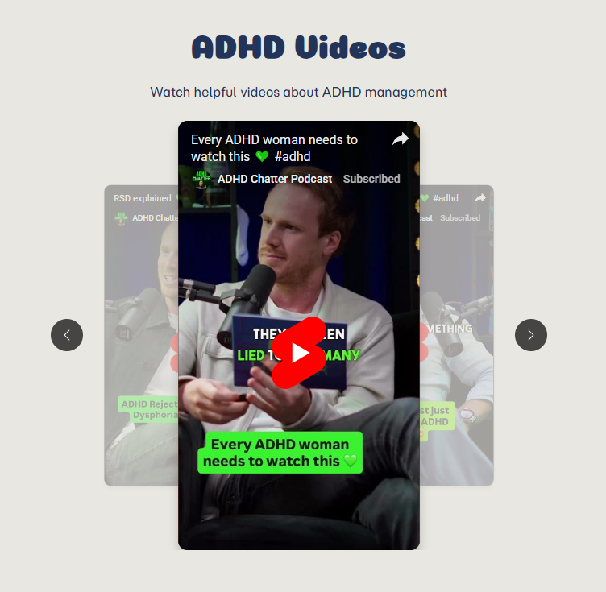

# ADHD Hacks

**Deployed Website:** https://realtimebasecamp.github.io/code-institute-adhd-hacks/

## Project Overview

An educational website designed to help people with ADHD manage their symptoms and improve daily productivity. This project was developed as part of the Code Institute Full Stack Boot Camp first assessment.

### Target Audience
People with ADHD or those supporting someone with ADHD who want to access resources, information, and tools for better symptom management.

## Features

### 1. ADHD Type Selector
Interactive radio button group with custom JavaScript that dynamically displays content for Inattentive, Hyperactive, and Combined ADHD types.

### 2. Dark/Light Mode Toggle
Theme switching with localStorage persistence and FOUC prevention, designed for neurodiverse readers who may have light sensitivity.

### 3. Interactive Charts
Chart.js implementation featuring theme-reactive pie and bar charts displaying ADHD statistics with automatic color updates.

### 4. Custom js carosel
Custom js implementation of a carosel for YouTube shorts. Videos are sampled from an array and loop around.

### 5. Resource Library
Curated collection of ADHD management tools including tips, products, music playlists (Spotify embed), and video content organized in Bootstrap accordions.

## Technologies Used
- **Framework:** Bootstrap 5.3.8
- **Icons:** [Font Awesome](https://fontawesome.com/)
- **Fonts:** 
  - [Momo Trust Sans](https://fonts.google.com/specimen/Momo+Trust+Sans) (body text)
  - [Coiny](https://fonts.google.com/specimen/Coiny) (headings)
- **Charts:** [Chart.js](https://www.chartjs.org/) for responsive pie and bar charts

## Design Process

### Wireframes
All wireframes were created using [Balsamiq](https://balsamiq.com/).

### Color Scheme
Retro theme inspired by [Smartsheet Dashboard Design Color Themes](https://www.smartsheet.com/content-center/product-insights/smartsheet-tips/smartsheet-dashboard-design-color-themes).

### Placeholder Images
[Dummy Image Generator](https://dummyimage.com/) was used to create placeholder images for responsive chart development.

### Design Approach
Detailed wireframes were used instead of user stories due to the 3-day project timeline, providing clear user flow and journey mapping.

## Validation
Chrome dev tools was used to generate the lighthouse results. Performance is impacted by the YouTube video and external charts.

## Deployment

**GitHub Pages Deployment Steps:**
1. Navigate to repository Settings → Pages
2. Source: Deploy from a branch
3. Select branch: `main`
4. Save

## Development Challenges

### Dark Mode FOUC (Flash of Unstyled Content)
**Problem:** The dark mode toggle caused a visual artifact when switching between pages.

**Solution:** Created an inline script that retrieves the cached user theme from localStorage and applies it before HTML elements render, eliminating the flash effect.

# Use of AI

## Code Generation & Workflow
1. Wireframe designs [NO AI]
2. Barebones HTML [NO AI]
3. Basic styling using bootstrap [NO AI]
4. Custom JS and CSS [SOME AI]
5. Validation and optimisation [MULTIPLE AI PASSES]

## AI’s role in identifying and resolving bugs, noting key interventions:
Claude Sonnet 4.5 was used to fix various grid and flexbox styling issues with responsive design. Multiple attempts were made before AI was used.

## How AI contributed to performance and UX improvements. Minimal documentation of AI use:
Claude 4.5 was used to optimise the CSS, JS file and removed redundant HTML.

### How AI influenced workflow, focusing on efficiency and outcomes without in-depth prompt documentation:
I used Github desktop copilot to automatically generate cleaner and more concise commit messages.

